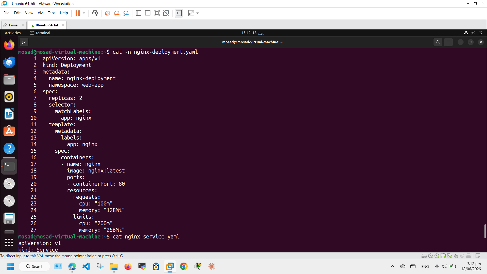
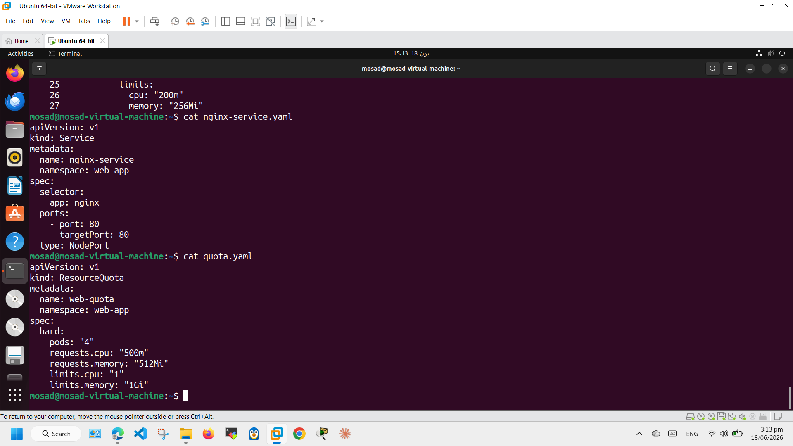

# Kubernetes Namespaces, Deployments, Services & ResourceQuota


## 📖 Overview

This repository contains Kubernetes Lab 03 demonstrating the deployment and management of applications using Kubernetes resources.

The lab covers:

- Creating and managing namespaces
- Deploying applications using Deployments
- Exposing applications using Services
- Scaling Deployments
- Applying ResourceQuota
- Managing MySQL environment variables
- Verifying Kubernetes resources

---

# 📌 Lab Objectives

- Create Kubernetes Namespaces
- Deploy Nginx Web Application
- Expose applications using NodePort Service
- Scale Deployments
- Apply ResourceQuota
- Deploy MySQL Database
- Configure Environment Variables
- Verify Kubernetes Resources

---

# 🛠 Technologies Used

- Kubernetes
- Minikube
- kubectl
- YAML
- Nginx
- MySQL

---

# 📂 Project Structure

```text
Kubernetes-Namespaces-Deployments-Services-ResourceQuota/
│
├── README.md
│
├── manifests/
│   ├── nginx-deployment.yaml
│   ├── nginx-service.yaml
│   ├── quota.yaml
│   └── mysql-deployment.yaml
│
├── commands/
│   ├── web-app-commands.md
│   └── db-app-commands.md
│
└── screenshots/
```

---

# 🚀 Lab 1 – Web Application

## Create Namespace

```bash
kubectl create namespace web-app
```

## Deploy Nginx

```bash
kubectl apply -f manifests/nginx-deployment.yaml
```

## Create Service

```bash
kubectl apply -f manifests/nginx-service.yaml
```

## Scale Deployment

```bash
kubectl scale deployment nginx-deployment --replicas=4 -n web-app
```

## Apply ResourceQuota

```bash
kubectl apply -f manifests/quota.yaml
```

---

# 🗄 Lab 2 – MySQL Deployment

## Create Namespace

```bash
kubectl create namespace db-app
```

## Deploy MySQL

```bash
kubectl apply -f manifests/mysql-deployment.yaml
```

## Configure Environment Variables

```bash
kubectl set env deployment/mysql-deployment \
MYSQL_ROOT_PASSWORD=root123 \
MYSQL_DATABASE=mydb \
-n db-app
```

---

# 🔍 Verification Commands

```bash
kubectl get namespaces

kubectl get deployments --all-namespaces

kubectl get pods --all-namespaces -o wide

kubectl get services --all-namespaces

kubectl get resourcequota --all-namespaces

kubectl get all -n web-app

kubectl get all -n db-app
```

---

# 📸 Deployment Screenshots

## 1. Create Web Namespace


---

## 2. Deploy Nginx Application


---

## 3. Create NodePort Service


---

## 4. Scale Deployment


---

## 5. Apply ResourceQuota


---

## 6. Verify ResourceQuota


---

## 7. Create Database Namespace


---

## 8. Deploy MySQL


---

## 9. Configure Environment Variables


---

## 10. Verify Rollout Status



---

## 11. Final Verification



---

# 📚 Key Learnings

- Kubernetes Namespace Isolation
- Deployment Management
- Service Exposure
- Deployment Scaling
- ResourceQuota Management
- Environment Variable Configuration
- Kubernetes Resource Verification
- YAML Manifest Deployment

---

# 👨‍💻 Author

**Mohamed Mosad Fahmy**

- GitHub: https://github.com/Mohamed-Mosad-98
- LinkedIn: https://www.linkedin.com/in/mohamed-mosad-516aa717b/

---

⭐ If you found this repository useful, don't forget to star it.
